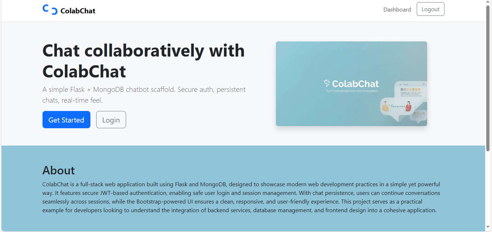

# ColabChat (Flask + MongoDB)

A minimal full-stack chatbot scaffold with authentication, JWT sessions, MongoDB persistence, and Bootstrap UI.

## Features
- Flask handles **UI + API**
- **MongoDB** collections:
  - `users`: `{ _id, username, email, passwordHash }`
  - `chats`: `{ _id, userId, messages: [{ sender, text, timestamp }] }`
- JWT stored in **HttpOnly cookie**
- **Logging** of requests/responses to `logs/app.log` (passwords redacted)
- **Environment variables** via `.env`
- Simple **chatbot placeholder** (echo-like response)
## 🌐 Live Demo


## Quickstart

```bash
python -m venv .venv
source .venv/bin/activate  # Windows: .venv\Scripts\activate
pip install -r requirements.txt


